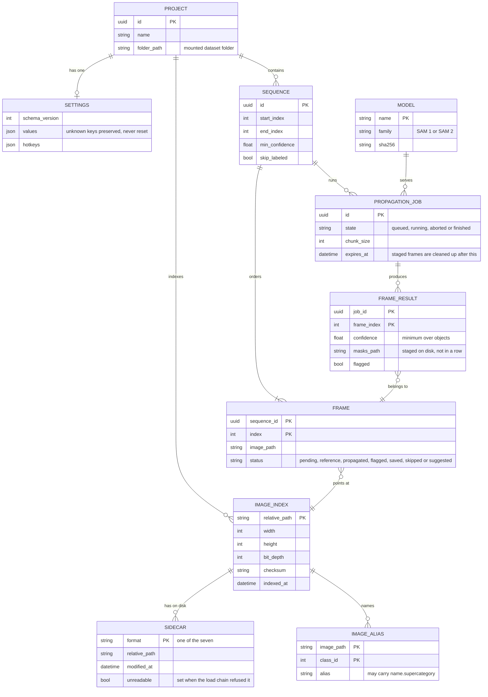

# SPECIFICATION: web-hosted LazyLabel

| | |
|---|---|
| Phase | 2 of `MODERNIZATION_BRIEF.md`, executed by `/code-modernization:modernize-reimagine` |
| Target | A React/TypeScript web app, a Node.js API, the Phase 1 annotation format library, and a Python inference service |
| Source | The existing analysis, not a fresh mining pass: `BUSINESS_RULES.md` (94 rules, 36 P0), `DATA_OBJECTS.md` (45 objects), `topology.json` (4 persona flows), `ASSESSMENT.md` |
| Produced | 2026-09-17, revised the same day after the architecture review |
| Capability scope | **Today's behavior only.** No new AI-native capability is in scope; the brief's Phase 2 refuses them at this checkpoint. |

The brief's Phase 2 risk note binds this step: the reimagine command would normally re-mine
specifications with three parallel agents, which would cost tokens and produce a second, conflicting
rule set. The rules were already mined, refereed, judged and corrected in this repository, so this
specification is assembled from them and cites them by id.

**Every rule id here is checked by `pipeline/check_citations.py`,** which fails if a document cites a
rule that does not exist or if a P0 rule has no capability. The first draft of this table mis-cited
roughly half its rules, including one id that does not exist, which a downstream agent would have turned into tests
wired to the wrong behavior.

## 1. Capabilities

| # | Capability | Persona | Rules | Built in |
|---|---|---|---|---|
| C1 | Open a folder of images and see which already carry annotations | Annotator | RULE-036, RULE-051, RULE-080 | P4 |
| C2 | Load an image's annotations from the best file present | Annotator, ML engineer | RULE-078, RULE-037, RULE-038, RULE-039, RULE-040, RULE-041, RULE-007 | P1 library, P4 wiring |
| C3 | Segment an object by clicking or boxing it with SAM | Annotator | RULE-020, RULE-062, RULE-066, RULE-027, RULE-021, RULE-091, RULE-089, RULE-074 | P3, P5 |
| C4 | Draw and edit polygons, boxes and circles by hand | Annotator without AI | RULE-047, RULE-043, RULE-046, RULE-015, RULE-069, RULE-070, RULE-061 | P5 |
| C5 | Erase, merge, split and reclass segments | Annotator | RULE-009, RULE-017, RULE-013, RULE-053 | P1 library, P5 interface |
| C6 | Undo and redo editing actions | Annotator | RULE-052, RULE-053, RULE-061 | P4, P5 |
| C7 | Assign classes and names, and decide which class wins an overlapping pixel | Annotator | RULE-011, RULE-012, RULE-014, RULE-042, RULE-086, RULE-007 | P1, P5 |
| C8 | Adjust the displayed image, threshold channels, rescale and crop | Annotator | RULE-028, RULE-029, RULE-030, RULE-031, RULE-032, RULE-024, RULE-016, RULE-045, RULE-067 | P5 |
| C9 | Save annotations in any of the seven formats, choosing which are written | All | RULE-079, RULE-001, RULE-002, RULE-003, RULE-004, RULE-005, RULE-006, RULE-010, RULE-080, RULE-083, RULE-014, RULE-059 | P1, P4 |
| C10 | Build a timeline from an image sequence and mark reference frames | Researcher | RULE-093, RULE-048, RULE-022, RULE-076, RULE-072, RULE-065, RULE-077 | P6 |
| C11 | Propagate labels through a sequence and review them by confidence | Researcher | RULE-044, RULE-025, RULE-026, RULE-018, RULE-060, RULE-081, RULE-082, RULE-063, RULE-073, RULE-075, RULE-019, RULE-023, RULE-090, RULE-055, RULE-058, RULE-064, RULE-071, RULE-035 | P3, P6 |
| C12 | Convert a dataset from one annotation format to another | ML engineer | RULE-078, RULE-079, RULE-037, RULE-039 | P1, P4 |
| C13 | Keep settings and hotkeys across sessions | All | RULE-088, RULE-049, RULE-050, RULE-033 | P2 schema, P4 interface |
| C14 | Compare two images side by side and annotate both together | Annotator | RULE-092, RULE-057 | P6, per decision 8 |

Rules not claimed by any capability are platform concerns rather than user-visible behavior:
RULE-084 (AI extras availability), RULE-085 (model type from file name), RULE-087 (checkpoint
integrity), RULE-054 and RULE-056 (the two silent-loss defects that decision 7 removes), RULE-034
and RULE-094 (display colour and click selection), RULE-068 (the Enter key's save shortcut).

**Deliberately not in scope.** Model training, dataset versioning, review workflows, collaborative
editing, label quality scoring, and any automated suggestion beyond what SAM already provides.

## 2. Domain model

**The annotation files beside the user's images are the source of truth** (decision 5, revised after
the architecture review). The database holds what those files cannot express: settings, hotkeys,
projects, sequences, job records, and an index of what the folder contains. There is no segment
table, so there is nothing to invalidate and no second copy to diverge.

Class aliases are keyed by image, not by project. Legacy destroys the alias table on navigation
(RULE-011) and multi-view keeps a separate id space per viewer (RULE-092); a project-scoped table
cannot express either, and would write one image's class name into another image's file (RULE-004).



In memory, a segment is a bounding box plus a local mask rather than a full-image array. Phase 1
measured 1,350 MB retained for 150 objects on a 3000-pixel image and left the type to this phase to
settle; a 100-megapixel image makes a single dense mask 100 MB. Frame results are staged on disk
under a job prefix and cleaned up on expiry, not stored as database blobs.

## 3. Interface contracts

### Annotations

```yaml
/projects/{projectId}/images/{imagePath}/annotations:
  get:
    summary: The image's annotations, read from the highest-priority sidecar present
    responses:
      "200":
        description: >
          Carries sourceFormat, the class names the file established, and how many lines or objects
          the reader rejected, so the client can say "412 unreadable lines" instead of showing an
          empty canvas.
      "204": { description: The image has no annotation file at all }
      "409":
        description: >
          A sidecar exists but cannot be read. Names the format that failed and the formats still
          present, so the client can offer one (decisions 15c and 15d). Never answered as an empty
          annotation set, and nothing is deleted on this path.
  put:
    summary: Write the selected formats for this image, in place, beside the image
    description: >
      Writes are atomic per file: a temporary file in the same directory, then a rename. A save with
      ZERO segments writes empty files for the selected formats rather than writing nothing, so
      clearing an image survives a reload. Sidecars in formats the user did not select are reported
      as stale and offered for removal, never deleted silently (decision 15f).
    responses:
      "200": { description: "{ written, stale, collisions } by format" }
      "409": { description: The file changed on disk since it was read; nothing was written }
      "422": { description: A segment or class violates a P0 rule; nothing was written }
```

Export work runs on a worker thread, not the request thread: Phase 1 measured about 5 seconds of
CPU-bound work for 150 objects on a 3000-pixel image, and the same process serves the propagation
progress socket.

### Images

The browser cannot decode 16-bit TIFF, and a 100-megapixel canvas is hundreds of megabytes, so the
API owns one image pipeline and is the only place the decoding rules live.

```yaml
/projects/{projectId}/images/{imagePath}/tiles/{z}/{x}/{y}:
  get: { summary: An 8-bit tile of the decoded image at zoom level z }
/projects/{projectId}/images/{imagePath}/thumbnail:
  get: { summary: A small preview for the dataset browser }
/projects/{projectId}/images/{imagePath}/rendered:
  post:
    summary: >
      Apply the display pipeline server-side and return the 8-bit pixels the model should see.
      This is what makes Operate On View (RULE-089) implementable: the adjusted pixels exist in one
      place rather than only in the browser, so the inference service can encode exactly what the
      user is looking at. The 16-bit to 8-bit conversion is RULE-024's truncating divide by 256,
      implemented once here rather than once in TypeScript and once in Python.
```

### Inference

```yaml
/inference/embeddings:
  post:
    summary: Prepare an image for interactive segmentation, returning a cache handle
    description: >
      Handles are scoped to the user, expire after 30 minutes idle, and are invalidated when the
      image or its display adjustments change. At most 10 are retained, and neighbours of the
      current image are precomputed, which is RULE-091's behavior and what makes the first click
      feel immediate.
/inference/segment:
  post: { summary: One SAM prediction from clicks or a box, returning the highest-scoring mask and its score }
/inference/propagations:
  post: { summary: Start a propagation job over a sequence; returns a job id }
  get: { summary: Job state and per-frame results as they complete }
/inference/propagations/{jobId}:
  delete: { summary: Cancel a running job, keeping frames already committed (RULE-063) }
```

Every inference response is typed; a failure is an error status, never an empty mask presented as
success (`ASSESSMENT.md` 5.4).

### Settings

```yaml
/users/me/settings:
  get: { summary: The user's settings and hotkeys, with the schema version }
  put:
    summary: Replace settings
    description: >
      Unknown keys are preserved, never reset. The legacy app discards every preference when one
      unrecognized key appears (RULE-088), which this schema fixes.
```

## 4. Non-functional requirements

| Area | Requirement | Where it comes from |
|---|---|---|
| Image size | Rejects above 100 megapixels. The supported working size is 50 megapixels with up to 500 objects; beyond that the browser is expected to degrade | the rejection cap is Phase 1's `src/limits.ts`; the working size is this phase's judgment, not evidence from legacy |
| Bit depth | 16-bit images are decoded and normalized server-side by the truncating divide RULE-024 specifies | RULE-024 |
| Sequence length | Hundreds of frames, propagated in overlapping chunks | RULE-026, RULE-019 |
| Interactive latency | p95 of 150 ms from click to mask on a 12-megapixel image with a warm embedding. A cold embedding is a full encode and is shown as a progress state rather than hidden | RULE-091, RULE-074 |
| Memory | Masks are region-bounded in memory; the undo stack is bounded by total retained bytes rather than entry count | Phase 1 measurements; RULE-052 records that legacy has no cap |
| Concurrency | One trusted user per deployment (decision 3); every route still carries a user scope | decision 3 |
| Model integrity | Checkpoints load from a manifest with SHA-256 checks and no runtime downloads | SEC-03, SEC-05, SEC-17, RULE-087 |
| Hostile input | Pixel, object, class and archive caps enforced in the format library; image types restricted by content, not extension | SEC-02, SEC-06, SEC-07, SEC-09; decision 9 adds .bmp, .gif and .webp |
| Durability | Annotation files are the user's, in the user's folder, and can be copied, diffed and backed up without this system | decision 5 |

### Failure modes

| When this is down | What still works | What the user sees |
|---|---|---|
| Inference service | Everything except SAM prompts and propagation: manual drawing, editing, loading, saving | AI tools disabled with the reason, as legacy does without the AI extras (RULE-084) |
| Database | Nothing persists across a reload, but annotations still load and save, because they are files | A banner saying settings are unavailable; annotation work continues |
| Dataset folder unreadable | Nothing | A blocking error naming the path, never an empty file list |
| A propagation worker dies | Frames already committed survive, as RULE-063 requires of an explicit abort | The job shows as failed with the frames it completed |

Every service exposes a health endpoint, every request carries a correlation id through to the
inference service, and logs are structured JSON. The legacy logger silently dropped records whose
filenames were not encodable (`ASSESSMENT.md` 5.4); the replacement must not.

## 5. Behavior contract

`BUSINESS_RULES.md` is the contract and is not restated here. The 36 P0 rules are the acceptance
tests, assigned per phase in `MODERNIZATION_BRIEF.md` section 5. Phase 1 has already proven its 28
against the legacy implementation in both directions.

For this phase: every scaffolded service carries an executable acceptance test for each P0 rule
assigned to it, and rules whose capability is not built yet fail as pending with their rule id
attached, so no rule silently loses its home.

## 6. Checkpoint 1 record

The reimagine command asks one question here: which capabilities are P0, and which should be
dropped. Answered on 2026-09-17 under the owner's blanket approval of the full plan, consistent with
the brief's Phase 2 scope statement:

- **P0 capabilities:** C2, C9 and C12, the read, write and convert path, because file compatibility
  with existing datasets is what this conversion promises. C3 and C4 follow, since a labeling tool
  that cannot label is not a tool. C13 is P0 for the schema only, because getting settings
  versioning wrong once costs every user their preferences.
- **Dropped:** nothing from today's behavior. C14 is conditional on decision 8.
- **Refused:** new AI-native capabilities, as the brief requires at this checkpoint.
