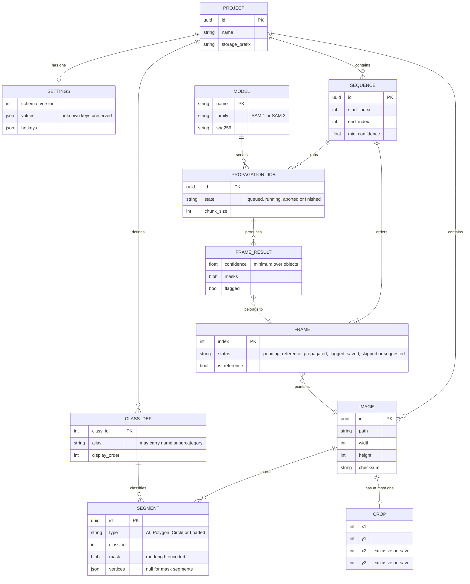

# SPECIFICATION: web-hosted LazyLabel

| | |
|---|---|
| Phase | 2 of `MODERNIZATION_BRIEF.md`, executed by `/code-modernization:modernize-reimagine` |
| Target | A React/TypeScript web app, a Node.js API, the Phase 1 annotation format library, and a Python inference service |
| Source | The existing analysis, not a fresh mining pass: `BUSINESS_RULES.md` (94 rules, 36 P0), `DATA_OBJECTS.md` (45 objects), `topology.json` (4 persona flows), `ASSESSMENT.md` |
| Produced | 2026-09-17 |
| Capability scope | **Today's behavior only.** No new AI-native capability is in scope; the brief's Phase 2 refuses them at this checkpoint. |

The brief's Phase 2 risk note binds this step: the reimagine command would normally re-mine
specifications with three parallel agents, which would cost tokens and produce a second, conflicting
rule set. The rules were already mined, refereed, judged and corrected in this repository, so this
specification is assembled from them and cites them by id.

## 1. Capabilities

Derived from the four persona flows and the domains they cross. Each names the rules that define it
and the phase that builds it, so nothing here is a capability without a home.

| # | Capability | Persona | Rules | Built in |
|---|---|---|---|---|
| C1 | Open a folder of images and see which already carry annotations | Annotator | RULE-051, RULE-089, RULE-093 | P4 |
| C2 | Load an image's existing annotations from the best file present | Annotator, ML engineer | RULE-078 and the seven format rules | P1 (library), P4 (wiring) |
| C3 | Segment an object by clicking or boxing it with SAM | Annotator | RULE-029, RULE-030, RULE-064 | P3, P5 |
| C4 | Draw and edit polygons, boxes and circles by hand | Annotator without AI | RULE-018, RULE-024, RULE-062 | P5 |
| C5 | Erase, merge, split and reclass segments | Annotator | RULE-011, RULE-012, RULE-015 | P5 |
| C6 | Undo and redo editing actions | Annotator | RULE-057, RULE-058 | P4, P5 |
| C7 | Assign classes and names, and control which class wins an overlapping pixel | Annotator | RULE-013, RULE-014 | P1, P5 |
| C8 | Adjust the displayed image, threshold channels and crop before export | Annotator | RULE-016, RULE-034 to RULE-036 | P5 |
| C9 | Save annotations in any of the seven formats, choosing which are written | All | RULE-079, RULE-006, the format rules | P1, P4 |
| C10 | Build a timeline from an image sequence and mark reference frames | Researcher | RULE-047, RULE-049 | P6 |
| C11 | Propagate labels through a sequence with SAM 2 and review by confidence | Researcher | RULE-056, RULE-080, RULE-081 | P3, P6 |
| C12 | Convert a dataset from one annotation format to another | ML engineer | RULE-078, RULE-079 | P1, P4 |
| C13 | Keep per-user settings and hotkeys across sessions | All | RULE-087, RULE-088 | P2, P4 |
| C14 | Compare two images side by side and annotate both together | Annotator | RULE-092 | P6, per decision 8 |

**Deliberately not in scope.** Model training, dataset versioning, review workflows, collaborative
editing, label quality scoring, and any automated suggestion beyond what SAM already provides. The
target is the current tool on the web, and decision 3 fixes the deployment at a single trusted user.

## 2. Domain model

The 45 catalogued objects collapse to nine entities once the PyQt6 view state is dropped. Widget
state (`Drawing / AI interaction state`, `Confidence histogram model`, the threshold widgets) becomes
client state and is not persisted. The divergent twins the analysis found, two `ReferenceAnnotation`
shapes and two `FrameStatus` enums, are unified here deliberately.



Two model decisions worth stating, because they differ from the legacy shape:

- **Class ids stay per image** (decision 6). `CLASS_DEF` is scoped to the project for naming, but a
  segment's `class_id` is the per-image id the exports carry, so an exported file is byte-identical
  to legacy. A project-wide label map may be layered on later as a view.
- **Masks are stored run-length encoded**, not as dense arrays. The format library still works in
  dense masks in memory, which the Phase 1 notes record as a follow-up; persistence does not have to
  inherit that, and a 3000-pixel image with 150 objects is 1.3 GB dense.

## 3. Interface contracts

The API is the only thing the web app talks to. The inference service is private to the API, so a
browser never holds a model endpoint.

### Annotations

```yaml
/projects/{projectId}/images/{imageId}/annotations:
  get:
    summary: The image's annotations, from the highest-priority file present
    responses:
      "200":
        content: { application/json: { schema: { $ref: "#/components/schemas/Annotations" } } }
      "409":
        description: >
          An annotation file exists but cannot be read. Carries the format that failed and the
          formats still available, so the client can offer one (decisions 15c and 15d). Never
          answered as an empty annotation set.
  put:
    summary: Replace the image's annotations and write the selected formats
    requestBody:
      content: { application/json: { schema: { $ref: "#/components/schemas/SaveRequest" } } }
    responses:
      "200": { description: Files written, listed by format }
      "422": { description: A segment or class violates a P0 rule; nothing was written }

components:
  schemas:
    Annotations:
      type: object
      required: [segments, classes, sourceFormat, rejected]
      properties:
        segments: { type: array, items: { $ref: "#/components/schemas/Segment" } }
        classes: { type: array, items: { $ref: "#/components/schemas/ClassDef" } }
        sourceFormat: { type: string, enum: [NPZ, YOLO_SEGMENTATION, COCO_JSON, NPZ_CLASS_MAP, PASCAL_VOC, CREATEML, YOLO_DETECTION] }
        rejected: { type: integer, description: Lines or objects the reader could not use }
    SaveRequest:
      type: object
      required: [segments, formats]
      properties:
        segments: { type: array, items: { $ref: "#/components/schemas/Segment" } }
        formats: { type: array, minItems: 1, items: { type: string } }
        crop: { $ref: "#/components/schemas/Crop" }
        pixelPriority: { type: object, properties: { enabled: { type: boolean }, ascending: { type: boolean } } }
```

**Saving never deletes** (decision 7). A save with zero segments writes nothing and returns the list
of stale files for the client to offer removal, rather than deleting them as the legacy app does.

### Inference

```yaml
/inference/embeddings:
  post:
    summary: Prepare an image for interactive segmentation, returning a cache handle
/inference/segment:
  post:
    summary: One SAM prediction from clicks or a box
    requestBody:
      content:
        application/json:
          schema:
            type: object
            required: [embeddingId, prompts]
            properties:
              embeddingId: { type: string }
              prompts:
                type: object
                properties:
                  points: { type: array, items: { type: object, properties: { x: { type: integer }, y: { type: integer }, positive: { type: boolean } } } }
                  box: { type: array, items: { type: integer }, minItems: 4, maxItems: 4 }
    responses:
      "200": { description: The highest-scoring mask, run-length encoded, with its score }
/inference/propagations:
  post:
    summary: Start a propagation job over a sequence; returns a job id
  get:
    summary: Job state and per-frame results as they complete
/inference/propagations/{jobId}:
  delete:
    summary: Cancel a running job, keeping frames already committed
```

Every inference response is typed; a failure is an error status, never an empty mask presented as
success (`ASSESSMENT.md` 5.4).

### Settings

```yaml
/settings:
  get: { summary: The user's settings and hotkeys, with the schema version }
  put:
    summary: Replace settings
    description: >
      Unknown keys are preserved, never reset. The legacy app discards every preference when one
      unrecognized key appears (ASSESSMENT.md 5.8, RULE-087), which this schema fixes.
```

## 4. Non-functional requirements

Inferred from the legacy code and the assessment, not invented.

| Area | Requirement | Where it comes from |
|---|---|---|
| Image size | Up to 100 megapixels per image, 16-bit TIFF included | the format library's pixel cap; `ASSESSMENT.md` image handling |
| Sequence length | Hundreds of frames per timeline, propagated in overlapping chunks | RULE-041 chunking, `PropagationState` |
| Interactive latency | A click-to-mask round trip must feel immediate, which is why embeddings are cached per image | legacy embedding cache of 10 entries, RULE-103 |
| Concurrency | One trusted user per deployment (decision 3); the API still scopes every route by user | decision 3 |
| Model integrity | Checkpoints load from a manifest with SHA-256 checks and no runtime downloads | SEC-03, SEC-05, SEC-17 |
| Hostile input | Pixel, object, class and archive caps enforced in the format library, not per consumer | SEC-02, SEC-06, SEC-07, SEC-09; Phase 1 `src/limits.ts` |
| Durability | An explicit save is the only thing that writes or removes annotation files | decision 7 |

## 5. Behavior contract

`BUSINESS_RULES.md` is the contract; it is not restated here. The 36 P0 rules are the acceptance
tests, assigned per phase in `MODERNIZATION_BRIEF.md` section 5. Phase 1 has already proven its 28
against the legacy implementation, both directions, byte for byte.

For this phase the contract means: every scaffolded service carries an executable acceptance test
for each P0 rule assigned to it, and rules whose capability is not built yet fail as pending with
their rule id attached, so no rule silently loses its home.

## 6. Checkpoint 1 record

The reimagine command asks one question here: which capabilities are P0, and which should be
dropped. Answered on 2026-09-17 under the owner's blanket approval of the full plan, consistent with
the brief's Phase 2 scope statement:

- **P0 capabilities:** C2, C9 and C12, the read, write and convert path, because file compatibility
  with existing datasets is what the conversion promises. C3 and C4 follow, since a labeling tool
  that cannot label is not a tool. C13 is P0 for the schema only, because getting settings versioning
  wrong once costs every user their preferences.
- **Dropped:** nothing from today's behavior. C14 is conditional on decision 8, which chose to
  rebuild multi-view as a split view rather than port the half-migrated legacy path.
- **Refused:** new AI-native capabilities, as the brief requires at this checkpoint.
