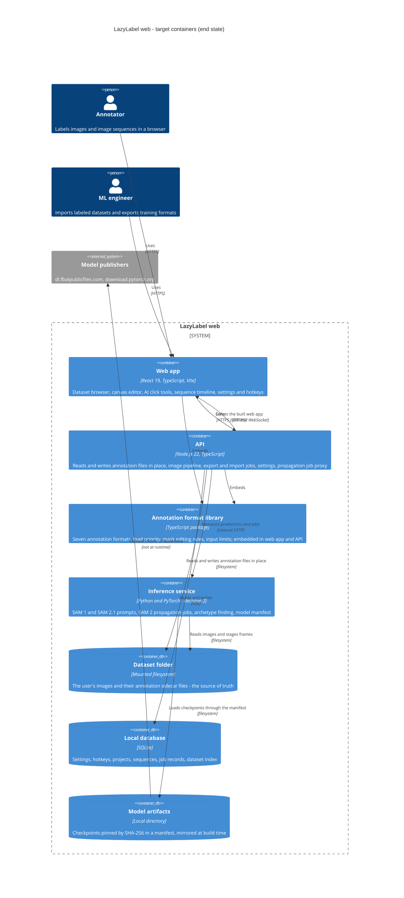

# REIMAGINED ARCHITECTURE: web-hosted LazyLabel

| | |
|---|---|
| Phase | 2 of `MODERNIZATION_BRIEF.md` |
| Specification | `AI_NATIVE_SPEC.md` |
| Status | Revised after the architecture review; the review's findings and this document's responses are in section 7 |
| Produced | 2026-09-17 |

## 1. Containers

**The sidecar files are the source of truth** (decision 5, revised after review). The database holds
only what files cannot express. That single choice is what keeps this to two running containers plus
an inference service, and it preserves the property the desktop app had and a database-backed design
silently gives up: the user's annotations are files in the user's folder, which they can copy, diff
and back up without this system.

## 2. Service boundaries

| Service | Owns | Does not own | Why |
|---|---|---|---|
| Annotation format library | The seven formats, the load priority chain, mask composition, pixel priority, crop, **and every editing operation that changes what a file contains**: erase-and-split, merge, class assignment, renumbering | File system access, paths, deletion | The brief's first binding design rule. A rule that decides file content must have exactly one implementation, or the browser and the API drift, which is the failure the library exists to prevent. |
| API | Reading and writing sidecars in place, the image pipeline, settings, projects, sequences, job records, serving the web app | SAM inference, interaction state, rendering | It is the only process that touches the dataset folder and the only one that talks to inference, so a browser never holds a model endpoint. |
| Inference service | SAM 1 and SAM 2.1 prompts, embeddings, propagation jobs, archetype finding | Annotation semantics, class ids, file formats | Decision 2 keeps the proven legacy model code in Python. Its interface speaks masks and scores, never LazyLabel classes. |
| Web app | Canvas rendering, tool interaction, timeline display, the undo stack, keyboard handling | Any rule that decides file content | Interaction state is not durable. The undo STACK is client state; the undo OPERATIONS it replays are library calls. |

Three boundary decisions the review forced, each because a rule would otherwise have had two
implementations or none:

- **Editing primitives move into the library.** RULE-009 (erase splits a segment and drops pieces of
  ten pixels or fewer), RULE-017 (merge takes the lowest selected class), RULE-011 (next free class
  id) and RULE-013 (renumber from table order) all change how many objects appear in an export. They
  were about to live in the browser with a server-side validator checking the same rule twice.
- **The image pipeline belongs to the API.** The browser cannot decode 16-bit TIFF, and RULE-024's
  truncating conversion must produce the same pixels for display and for the model. With Operate On
  View enabled (RULE-089) the pixels SAM encodes are the adjusted ones, which only exist server-side
  if the server is what adjusts them.
- **Export runs on a worker thread.** Phase 1 measured about five seconds of CPU-bound work for 150
  objects on a 3000-pixel image, in the same process that serves the propagation progress socket.

## 3. Technology choices

| Choice | Justification |
|---|---|
| React 19 with TypeScript and Vite | The target the owner set; Vite matches the preflight-proven toolchain. |
| Node.js 22 with TypeScript for the API | Shares the format library with the browser without a second implementation of any file rule. |
| SQLite | Decision 5. Settings, projects, sequences and jobs are a few thousand rows for one user. A server database would add an operational burden for state that fits in a file. |
| The mounted dataset folder | Decision 5. Annotations stay where the user put them, which makes the ML engineer's convert-and-reuse flow a no-op rather than an export feature. |
| Python and PyTorch for inference | Decision 2. SAM 2 video propagation has no browser equivalent, and the legacy model code is proven. |
| Region-bounded masks in memory | A dense mask on a 100-megapixel image is 100 MB; Phase 1 measured 1,350 MB retained for one realistic editing session. |
| A local credential or reverse-proxy auth | Decision 3. An external identity provider would put a third party in the critical path of opening your own images on your own machine. |

## 4. Data migration

There is no legacy database, and with decision 5 there is no data migration either: the new system
reads the folder the old one wrote.

1. **Indexing, not importing.** Opening a project walks the folder and records what exists. Images
   are not copied and annotations are not converted. The load-priority chain runs at read time, and
   Phase 1 proved it returns the same segments as the legacy loader.
2. **Pickled alias tables.** Existing `.npz` and `_CM.npz` files carry class names as a pickled
   Python dict, which nothing in the new stack will unpickle (SEC-01). A converter rewrites those
   files with the JSON alias member. It runs as a separate short-lived process with no network
   access, no credentials, and the dataset mounted; it writes to a new path and never in place; and
   it is the only component in the system permitted to load pickle. It also handles legacy files
   written in a Windows locale encoding rather than UTF-8. Scheduled for Phase 4, when import
   arrives.
3. **The interim state is visible.** Until a dataset is converted, its masks load correctly and its
   class names do not. That is acceptable, because masks are irreplaceable and names are recoverable
   by running the converter, but only if the user is told: the dataset browser marks such datasets,
   and the export path warns before writing files whose class names would read `Class 3` where the
   original said `stop sign`.
4. **Settings and hotkeys.** Imported once into the versioned schema, preserving unknown keys rather
   than discarding every preference the way the legacy loader does (RULE-088).
5. **Model checkpoints.** Mirrored to disk by the build pipeline and pinned by SHA-256 in a manifest.
   Nothing downloads a model at runtime.

## 5. What is still open

- **C14, the split view** (decision 8, RULE-092). The per-viewer class-id space it needs is not
  modeled, and its SME question is unanswered. It stays out of the domain model until Phase 6 entry.
- **RULE-090's second load chain.** Sequence mode merges propagated masks per class before saving,
  which changes exported box counts depending on whether the user visited the frame. It belongs in
  the library with the other content rules, and its preserve-or-fix question is a Phase 6 decision.
- **Backup.** With annotations as files, the user's existing backup of their dataset folder covers
  them. The database holds settings and job history; a documented copy of one SQLite file is the
  whole story, and it should be written down before release.

## 6. Checkpoint 2 record

The reimagine command stops here for approval before anything is scaffolded. Recorded on 2026-09-17
under the owner's blanket approval of the full plan, which the brief's section 8 records as covering
the full plan.

**One thing genuinely needs the owner's eye rather than a blanket approval:** the container set
changed after review. The plan the owner approved named PostgreSQL and S3-compatible object storage;
this document specifies the dataset folder plus SQLite instead, for the reasons in section 7. That
is a smaller system and a reversal of an answer taken on the owner's behalf, not a detail.

Scaffolding order follows the brief's Phase 2 pilot: **the API first**, with one acceptance test
from the behavior contract wired to the Phase 1 library, before the web app and inference scaffolds.

## 7. The architecture review, and what changed

An adversarial review checked this document against the specification, the brief and the Phase 1
notes. It found eight high-severity problems and returned a verdict of "not yet fit to scaffold
against". Its central point was that the architecture phase had added boundaries and a data model
but left the three questions that actually determine a scaffold unanswered.

| Finding | Response |
|---|---|
| Two sources of truth for annotations, never resolved: a segment table and a file chain | Adopted. The files are the source of truth; the segment table is gone. Decision 5 is reversed and the brief regenerated. |
| A project-scoped class table contradicts decision 6 and would write one image's class name into another's file | Adopted. Aliases are keyed by image and class id. |
| Rules that decide file content were stranded in the browser, against this document's own boundary rule | Adopted. Erase, merge, class assignment and renumbering move into the format library. |
| "A save with zero segments writes nothing" resurrects deleted work on the next load | Adopted. A save writes empty files for the selected formats. |
| Operate On View and 16-bit images had no workable path, and no image pipeline existed | Adopted. The API owns one pipeline: decode, normalize, tile, and render adjusted pixels for the model. |
| No route for converted files to reach the user's folder | Resolved by the source-of-truth change: writes land beside the images. |
| The storage and identity tier was sized for a multi-tenant service that decision 3 says will not exist | Adopted. Two containers and an inference service, no object storage, no external identity provider. |
| The capability-to-rule table mis-cited about half its rules and cited one id that does not exist | Adopted. The table was rebuilt from the catalog, and `pipeline/check_citations.py` now fails the build on a bad citation or an orphaned P0 rule. |

Medium findings adopted in this revision: auto-save on navigation stays and RULE-059 is answered on
its card before scaffolding; a latency budget, an embedding lifetime and prefetch are specified;
export moves to a worker; frame results are staged on disk with an expiry rather than stored as
database blobs; failure modes, health endpoints and a correlation id are specified; stale sidecars
and base-name collisions are reported in the save response.

Deferred with reasons: modeling the split view (waits for Phase 6 entry, decision 8), and RULE-090's
merge question (a Phase 6 preserve-or-fix decision).
