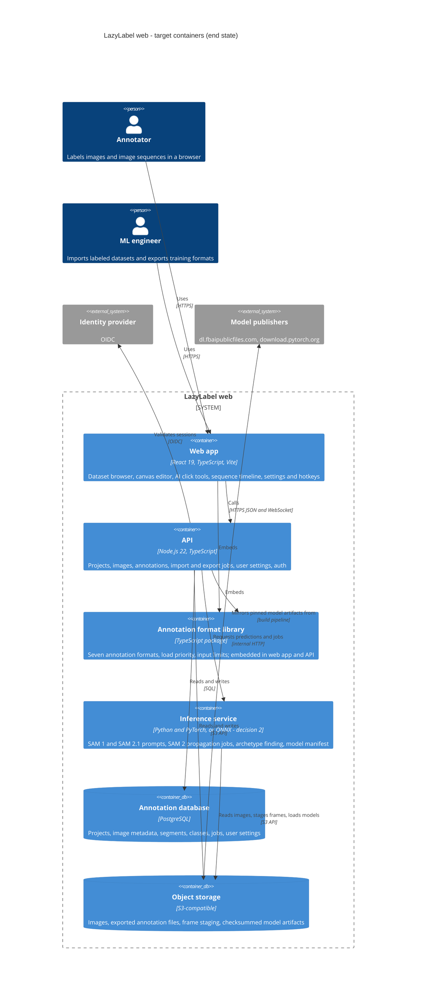

# REIMAGINED ARCHITECTURE: web-hosted LazyLabel

| | |
|---|---|
| Phase | 2 of `MODERNIZATION_BRIEF.md` |
| Specification | `AI_NATIVE_SPEC.md` |
| Status | Reviewed by the architecture critic; checkpoint 2 recorded in section 6 |
| Produced | 2026-09-17 |

This is the end state the brief's section 2 approved, expanded into service boundaries, technology
choices and a migration path. It does not introduce a container the brief did not already name. If
it ever diverges from the brief, the brief is regenerated to match, as Phase 2's exit criteria say.

## 1. Containers

## 2. Service boundaries, and why each line falls where it does

| Service | Owns | Does not own | Why |
|---|---|---|---|
| Annotation format library | The seven formats, the load priority chain, mask composition, pixel priority, crop, input limits | File system access, deletion, paths, storage | One library for both consumers is the brief's first binding design rule: the legacy suffix-to-format mapping is written out four times and drifted. Returning content rather than writing files is what lets the browser and the API share it. |
| API | Projects, images, segments, classes, settings, export and import jobs, model manifest, auth | SAM inference, rendering, interaction state | Everything that must survive a refresh or be shared. It is also the only service that talks to the database and to inference, so a browser never holds a model endpoint. |
| Inference service | SAM 1 and SAM 2.1 prompts, embeddings, propagation jobs, archetype finding | Annotation semantics, class ids, file formats | Decision 2 keeps the legacy model code in Python rather than reimplementing it. Its interface speaks masks and scores, never LazyLabel classes, so the annotation rules stay in one place. |
| Web app | Canvas rendering, drawing tools, timeline, undo stack, keyboard handling, display adjustments | Any rule that decides file content | Interaction state is not durable. The rules it does enforce, such as the polygon join threshold, live in shared code the API can also run. |

**The undo stack is client state.** The legacy undo history is per image, unbounded and cleared on
navigation (RULE-057). Keeping it in the browser preserves that behavior exactly and avoids a
write-heavy table that no capability needs.

**Sequence propagation is a job, not a request.** The legacy app runs it on a worker thread and
cancels with `QThread.terminate()`, which the assessment flags as unsafe. A job with an explicit
cancel is the smallest honest model for work that runs for minutes and must survive a page reload.

## 3. Technology choices

| Choice | Justification |
|---|---|
| React 19 with TypeScript and Vite | The target the owner set. Vite matches the preflight-proven toolchain. |
| Node.js 22 with TypeScript for the API | Shares the format library with the browser without a second implementation, which is the whole reason that library exists. |
| PostgreSQL | Decision 5. Segments, classes and settings are relational and need transactions; a save that half-succeeds is the failure mode decision 7 exists to prevent. |
| S3-compatible object storage, MinIO when self-hosted | Decision 5. Images and exported files are large and immutable; they do not belong in rows. |
| Python and PyTorch for inference | Decision 2. SAM 2 video propagation has no browser equivalent, and the legacy model code is proven. An in-browser ONNX decoder stays the fallback if click latency demands it. |
| Run-length encoded masks in the database | A dense 3000-pixel mask is 9 MB per object. The format library works in dense masks in memory; persistence does not have to inherit that. |
| OIDC for identity | Decision 3 fixes a single trusted user per deployment, but every route carries a user scope so multi-tenancy is a policy change rather than a redesign. |
| No ORM-generated schema | The migration has to read legacy `settings.json` and sidecar files whose shapes are fixed; explicit SQL keeps that mapping visible. |

## 4. Data migration

There is no legacy database. State lives in annotation files beside images, `settings.json`,
`hotkeys.json`, and model checkpoints, all of which the analysis has already mapped.

1. **Images and sidecars.** A project import walks a folder, uploads images to object storage, and
   reads each image's annotations through the load-priority chain, which Phase 1 proved matches the
   legacy loader segment for segment.
2. **Pickled alias tables.** Existing `.npz` and `_CM.npz` files carry class names as a pickled
   Python dict, which nothing in the new stack will ever unpickle (SEC-01). An offline converter,
   run once per dataset, rewrites those files with the JSON alias member; it is the only component
   permitted to load pickle, it runs outside the API, and it refuses any file it did not just read
   from disk. Until a dataset is converted, its masks import correctly and its class names do not.
3. **Settings and hotkeys.** Imported once into the versioned schema, preserving unknown keys rather
   than discarding every preference the way the legacy loader does.
4. **Model checkpoints.** Mirrored into object storage by the build pipeline and pinned by SHA-256 in
   a manifest. Nothing downloads a model at runtime.
5. **Nothing is deleted.** The importer only reads. The legacy folder stays exactly as it was, which
   matters because the desktop app remains installable until Phase 6 exit (decision 1).

## 5. What the critic changed

The architecture critic reviewed this against the specification. Findings and responses are recorded
in section 7 after the review, so a reader can see what was challenged rather than only the result.

## 6. Checkpoint 2 record

The reimagine command stops here for approval before anything is scaffolded. Approved on 2026-09-17
under the owner's blanket approval of the full plan ("yeah do it all"), which the brief's section 8
records as covering the full plan.

Scaffolding order follows the brief's Phase 2 pilot: **the API first**, with one acceptance test from
the behavior contract wired to the Phase 1 library, before the web app and inference scaffolds. What
the pilot surfaces is expected to revise this document.
